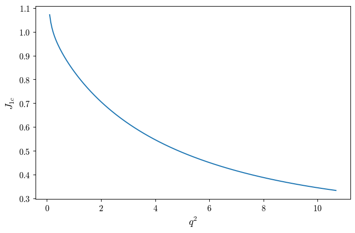
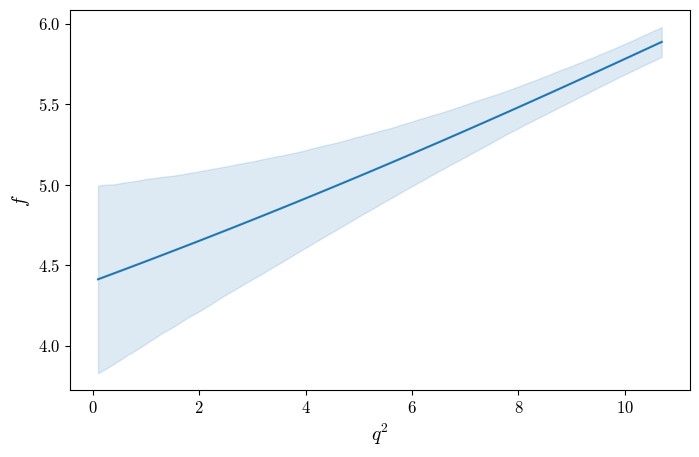
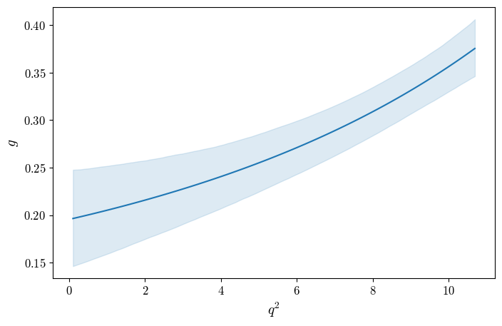
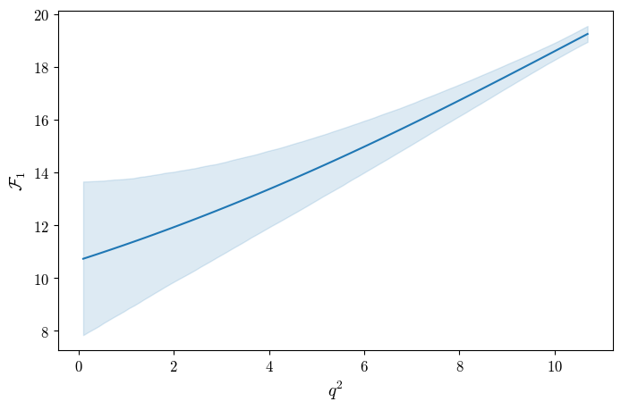
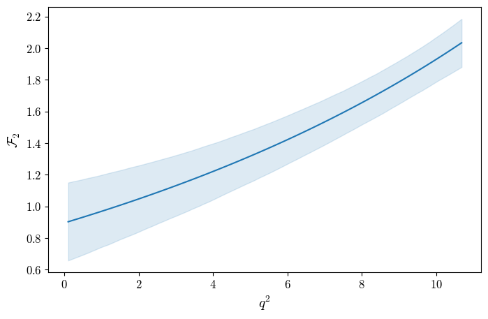

# Using SLOP

## Getting a Prediction

To get a prediction, you must initialise a prediction object for the decay mode of interest and specify the form-factor scheme. You can then calculate a variety of observables. You can check available observables for available decay modes in the Python API.

```{code-block} python

from slophep.Predictions.Observables import BdToDstEllNuPrediction
from slophep.Predictions.FormFactorsBToV import BdToDstFF

pred = BdToDstEllNuPrediction("mu", "mu", BdToDstFF.CLN)
angobs = pred.J(q2=5.0)
print(angobs)
```

Where the example above computes rate-normalised angular observables in $B^0 \to D^{*}\mu\nu$ at $q^2 = 5.0$ $\text{GeV}^2$, using CLN form-factors, and prints out:

```
{'1s': 0.3805129434370365, '1c': 0.4933741604586339, '2s': 0.12646033489965114, '2c': -0.48972052780118125, '6s': -0.3912727821568956, '6c': 0.0035799980114745145, 3: -0.16082906069974, 4: 0.3182936823105255, 5: -0.3021657916707698, 7: -0.0, 8: 0.0, 9: -0.0}
```


You may generate predictions for a range of values and plot to your preference,

```{code-block} python

import matplotlib.pyplot as plt
import numpy as np

qsq = np.linspace(0.1, 10.68, 250)
j1cvals = [pred.J(iq2)["1c"] for iq2 in qsq]

fig, ax = plt.subplots(1, 1)
ax.plot(qsq, j1cvals)
ax.set(xlabel = r"$q^2$", ylabel = r"$J_{1c}$")
fig.savefig("j1c_plot.png")
```



You may change the form-factor parameters using the `pred.set_ff` and providing a dictionary with different parameters:

```{code-block} python

hqet2 = {
    "RhoSq" : 1.122,
    "h_A1"  : 0.908,
    "R1"    : 1.270,
    "R2"    : 0.852,
    "R0"    : 1.15
}
pred.set_ff(hqet2)
```

Similarly, you can specify Wilson coefficients using `pred.set_wc`:

```{code-block} python

wcoeffs = {
    "CVL_bcmunumu" : 0.0, 
    "CVR_bcmunumu" : 0.5,
    "CSL_bcmunumu" : 0.0,
    "CSR_bcmunumu" : 0.0,
    "CT_bcmunumu"  : 0.0
}
pred.set_wc(wcoeffs)
```

These are by default in the [WET `flavio` basis](https://wcxf.github.io/bases.html), but you may specify a different basis 
through the additional `eft` and `basis` arguments, e.g. `pred.set_wc(wcoeffs, eft="WET", basis="flavio")`.


## Producing Errorbands

It is often desirable to get an errorband/uncertainty for a particular prediction based on uncertainties on the form-factor parameters. In SLOP this can be done provided central values and a covariance matrix. Fluctuations around the central values are produced sampling from a multivariate Gaussian. Observables can be recomputed for each fluctuation in order to obtain an uncertainty for a particular confidence interval.

In the following example we will produce errorband plots for HPQCD form-factors. First we have to create the sampler. Central values and covariance matrix can be specified and loaded in using a `json` file.

```{code-block} python

from slophep.Predictions.SamplingFluctuate import SamplingHelper
import slophep.Predictions.FormFactorsBToV.BdToDstFF as BdToDstFF

ff_hpqcd = BdToDstFF.HPQCD()
sampler = SamplingHelper(ff_hpqcd)
sampler.set_params_from_configfile("data/BToDstFF_HPQCD_COV_arXiv230403137.json")
sampler.fluctuate(5000, seed = 23)
```
This creates a sampler for `ff_hpqcd`, then loads in central values and a covariance matrix from [data/BToDstFF_HPQCD_COV_arXiv230403137.json](https://github.com/dvicoben/slophep/blob/master/data/BToDstFF_HPQCD_COV_arXiv230403137.json), and generates 5000 fluctuations.


```{note}

The available samplers assume Gaussian uncertainties. If this is not the case, the resulting errorbands will not provide proper coverage.
```

We can then get error for a particular prediction using:
```
error = sampler.get_error("get_ff_gfF1F2_basis", [5.0], cl = 0.683)
```
where the first argument `"get_ff_gfF1F2_basis"` is a method/attribute of `ff_hpqcd` (the prediction we are sampling), `[5.0]` are the arguments (if any) of said method, in this case meaning $q^2 = 5.0$, and `cl = 0.683` is the desired confidence level. Evidently, one should generate sufficient fluctuations for the confidence level they wish to get. The sampler then executes `ff_hpqcd.get_ff_gfF1F2_basis(5.0)` for each fluctuation it produced and returns lower bound $0.5(1 - \text{cl})$ and upper bound $1 - 0.5(1-\text{cl})$. The result is the following:
```
{'g': (0.22465584646367406, 0.2855120197285509), 'f': (4.802507427470645, 5.298068376931277), 'F1': (12.948251433554075, 15.348613421503183), 'F2': (1.1530171489087755, 1.4805005904051707)}
```
where each form-factor has (lower bound, upper bound). You may get the central value simply from `ff_hpqcd.get_ff_gfF1F2_basis(5.0)` or from `sampler.central_val("get_ff_gfF1F2_basis", [5.0])`, which returns:
```
{'g': 0.2550905599240187, 'f': 5.051578838112474, 'F1': 14.147985170441885, 'F2': 1.3172114425155639}
```

Given that the output in quite a few cases is a dictionary, it's convenient to make a quick function to get an errorband for the $q^2$ spectrum:
```
def get_spectrum_dict(qsq, pred, attr, sampler):
    res = {}
    for iq2 in qsq:
        o_err = sampler.get_error(attr, [iq2])
        o = getattr(pred, attr)(iq2)
        for iobs in o:
            if iobs not in res:
                res[iobs] = {"val" : [], "lo" : [], "hi" : []}
            res[iobs]["val"].append(o[iobs])
            res[iobs]["lo"].append(o_err[iobs][0])
            res[iobs]["hi"].append(o_err[iobs][1])
    return res

qsq = np.linspace(0.1, 10.69, 100)
bands = get_spectrum_dict(qsq, ff_hpqcd, "get_ff_gfF1F2_basis", sampler)

form_factors = ["g", "f", "F1", "F2"]
labels = [r"$g$", r"$f$", r"$\mathcal{F}_1$", r"$\mathcal{F}_2$"]
for iff, ilabel in zip(form_factors, labels):
    ires = bands[iff]
    fig, ax = plt.subplots(1, 1)
    line = ax.plot(qsq, ires["val"])
    fill = ax.fill_between(qsq, ires["lo"], ires["hi"], color=line[0].get_color(), alpha=0.15)
    ax.set(xlabel=r"$q^2$", ylabel=ilabel)
    fig.savefig(f"plot_errorband_{iff}.png")
    plt.close(fig)
```

| ||
|-----|--|
|||
