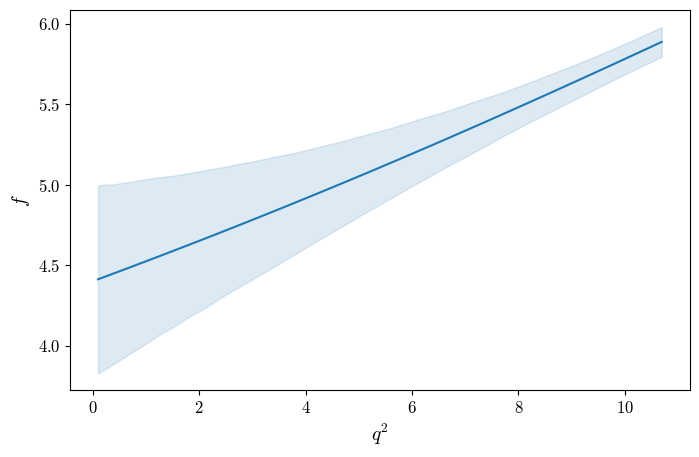
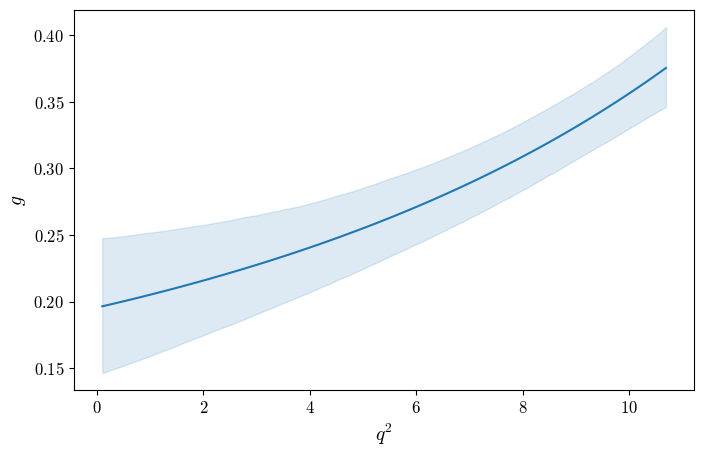
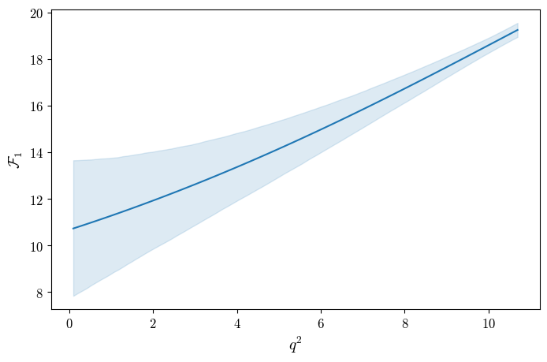
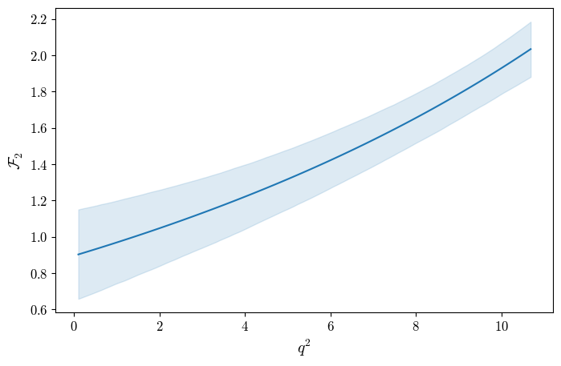

(baseuse-producing-errorbands)=
# Producing Errorbands

It is often desirable to get an errorband/uncertainty for a particular prediction based on uncertainties on the form-factor parameters. In SLOP this can be done provided central values and a covariance matrix. Fluctuations around the central values are produced sampling from a multivariate Gaussian. Observables can be recomputed for each fluctuation in order to obtain an uncertainty for a particular confidence interval.

In the following example we will produce errorband plots for HPQCD form-factors. First we have to create the sampler. Central values and covariance matrix can be specified and loaded in using a `json` file.

```{code-block} python

from slophep.Tools import ErrorSampler
import slophep.FormFactors import BdToDstFF

ff_hpqcd = BdToDstFF.HPQCD()
sampler = ErrorSampler.create_from_configfile("data/BdToDstFF_HPQCD_COV_arXiv230403137.json")
sampler.fluctuate(5000)
```
This creates a sampler, loads in central values and a covariance matrix from [data/BdToDstFF_HPQCD_COV_arXiv230403137.json](https://github.com/dvicoben/slophep/blob/master/data/BdToDstFF_HPQCD_COV_arXiv230403137.json), and generates 5000 fluctuations.


```{note}

The available samplers assume Gaussian uncertainties. If this is not the case, the resulting errorbands will not provide proper coverage. It is possible to use user-provided fluctuations instead of generating them with SLOP for these cases (see `ErrorSampler.create_custom` in the API).
```

We can then get error for a particular prediction using:
```
error = sampler.get_error(ff_hpqcd, "get_ff_gfF1F2_basis", [5.0], cl = 0.683)
```
where the first argument is the `ParameterUser` whose values we want to sample/fluctuate (in this case `ff_hpqcd`) `"get_ff_gfF1F2_basis"` is a method/attribute of `ff_hpqcd` (the prediction we are sampling), `[5.0]` are the arguments (if any) of said method, in this case meaning $q^2 = 5.0$, and `cl = 0.683` is the desired confidence level. Evidently, one should generate sufficient fluctuations for the confidence level they wish to get. The sampler then executes `ff_hpqcd.get_ff_gfF1F2_basis(5.0)` for each fluctuation it produced and returns lower bound $0.5(1 - \text{cl})$ and upper bound $1 - 0.5(1-\text{cl})$. The result is the following:
```
{'g': (0.22465584646367406, 0.2855120197285509), 'f': (4.802507427470645, 5.298068376931277), 'F1': (12.948251433554075, 15.348613421503183), 'F2': (1.1530171489087755, 1.4805005904051707)}
```
where each form-factor has (lower bound, upper bound). You may get the central value from `sampler.get_central(ff_hpqcd, "get_ff_gfF1F2_basis", [5.0])`, which returns:
```
{'g': 0.2550905599240187, 'f': 5.051578838112474, 'F1': 14.147985170441885, 'F2': 1.3172114425155639}
```

Given that the output in quite a few cases is a dictionary, it's convenient to make a quick function to get an errorband for the $q^2$ spectrum:
```
def get_spectrum_dict(qsq, pred, attr, sampler):
    res = {}
    for iq2 in qsq:
        o_err = sampler.get_error(pred, attr, [iq2])
        o = sampler.get_central(pred, attr, [iq2])
        for iobs in o:
            if iobs not in res:
                res[iobs] = {"val" : [], "lo" : [], "hi" : []}
            res[iobs]["val"].append(o[iobs])
            res[iobs]["lo"].append(o_err[iobs][0])
            res[iobs]["hi"].append(o_err[iobs][1])
    return res

qsq = np.linspace(0.1, 10.69, 100)
bands = get_spectrum_dict(qsq, ff_hpqcd, "get_ff_gfF1F2_basis", sampler)

form_factors = ["g", "f", "F1", "F2"]
labels = [r"$g$", r"$f$", r"$\mathcal{F}_1$", r"$\mathcal{F}_2$"]
for iff, ilabel in zip(form_factors, labels):
    ires = bands[iff]
    fig, ax = plt.subplots(1, 1)
    line = ax.plot(qsq, ires["val"])
    fill = ax.fill_between(qsq, ires["lo"], ires["hi"], color=line[0].get_color(), alpha=0.15)
    ax.set(xlabel=r"$q^2$", ylabel=ilabel)
    fig.savefig(f"plot_errorband_{iff}.png")
    plt.close(fig)
```

| ||
|-----|--|
|||

