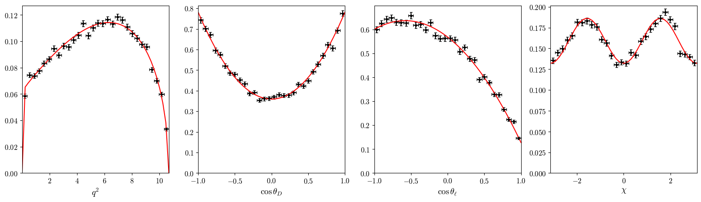

# Generating Pseudo-events

You can use the PDFs defined in the predictions to generator pseudo-data. The sampling is performed using [`pypmc`](https://github.com/pypmc/pypmc) in an implementation analogous to the one used by [`EOS`](https://eoshep.org/doc/user-guide/simulation.html). 

In this example, we will be sampling $B \to D^{*}\mu\nu$ decay rate with CLN form-factors.
```{code-block} python

import numpy as np
from slophep.Observables import BdToDstEllNuPrediction
from slophep.FormFactors import BdToDstFF
from slophep.Tools import MCGenerator

pred = BdToDstEllNuPrediction("mu", "mu", BdToDstFF.CLN())
gen = MCGenerator(seed=230)
```
We want to sample `pred.PDF(q2, ctx, ctl, chi)`, so we specify the function and its bounds to the generator.
```{code-block} python
bounds = [(pred.q2min, pred.q2max), (-1, 1), (-1, 1), (-np.pi, np.pi)]
gen.setPDF(pred.PDF, bounds)
```
Now, in a manner analogous to [`EOS`](https://eoshep.org/doc/user-guide/simulation.html), we can sample the function we just set:
```
evt = gen.sample_mcmc(N=60000, stride=5, preruns=3, preN=1000)
```
We can have a quick look at the output using `print(evt)`, which shows:
```
[[ 0.98132345 -0.46754353 -0.78597575 -0.667644  ]
 [ 0.98132345 -0.46754353 -0.78597575 -0.667644  ]
 [ 1.10460372  0.50020543 -0.57389166 -1.062507  ]
 ...
 [ 0.07730708  0.85886174  0.36422471 -1.93721183]
 [ 1.60889831  0.43422212  0.52517457  2.66609552]
 [ 1.60889831  0.43422212  0.52517457  2.66609552]]
```
where each element in `evt` is a point $[ q^2, \cos\theta_D, \cos\theta_\ell, \chi ]$. We can plot projections of the pseudo-data compared to the decay rate predictions (how to plot this is shown in the [available example](https://github.com/dvicoben/slophep/blob/master/examples/example_mcgen.py)), and obtain the following:




Note that the generation is left as flexible as possible. One could specify a different `Callable` and/or bounds in `gen.setPDF`, e.g. `pred.dGdq2` for just the shape in $q^2$.